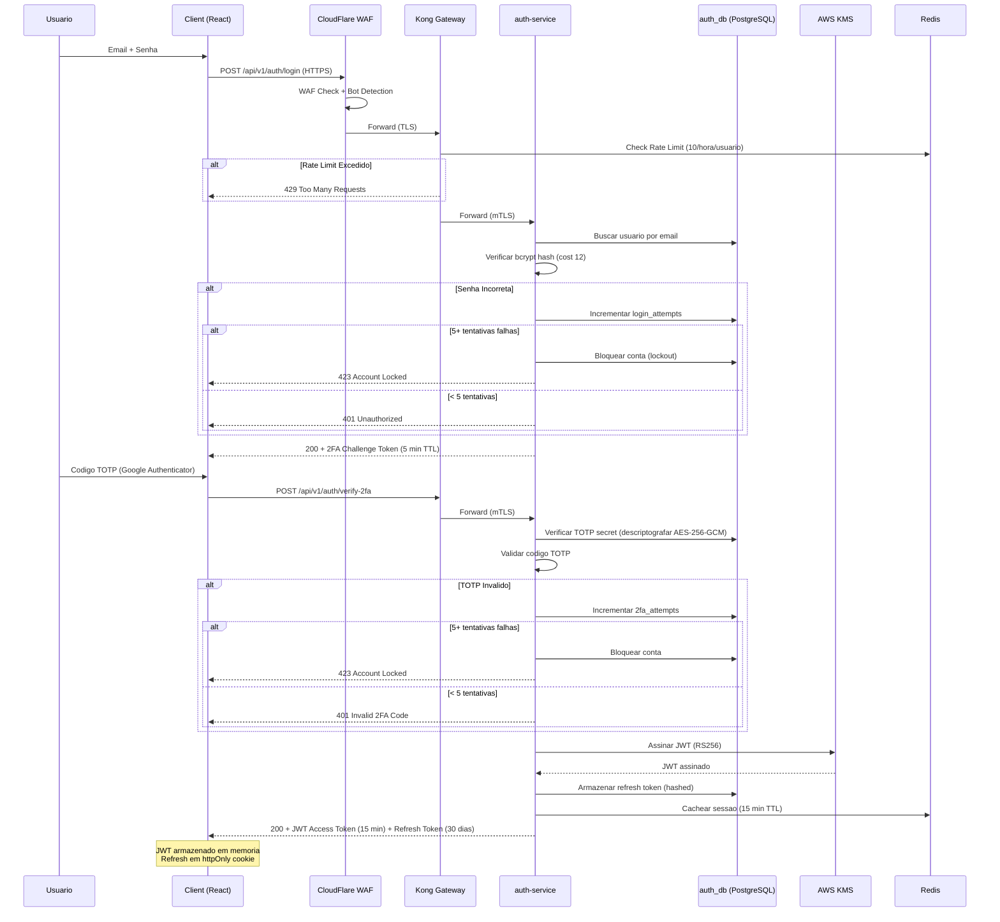
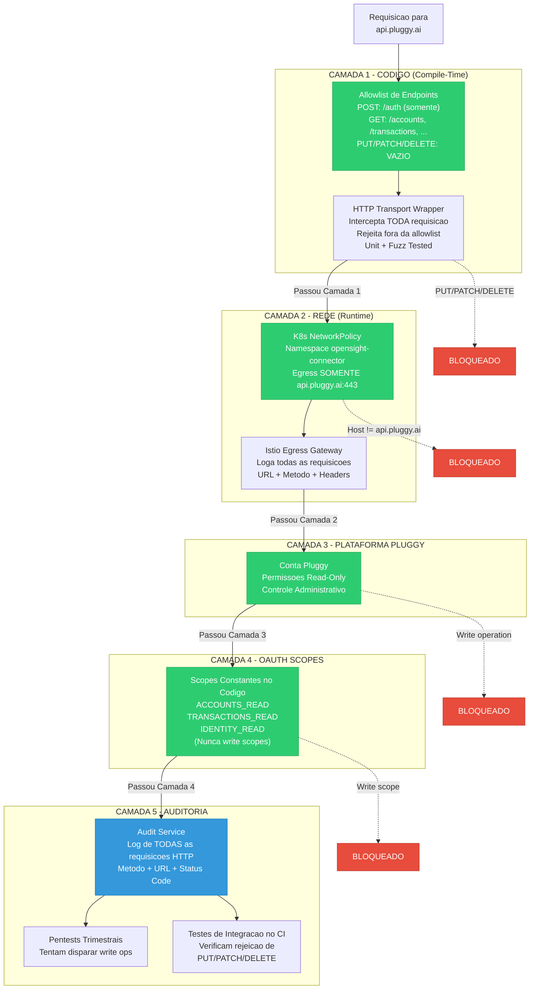
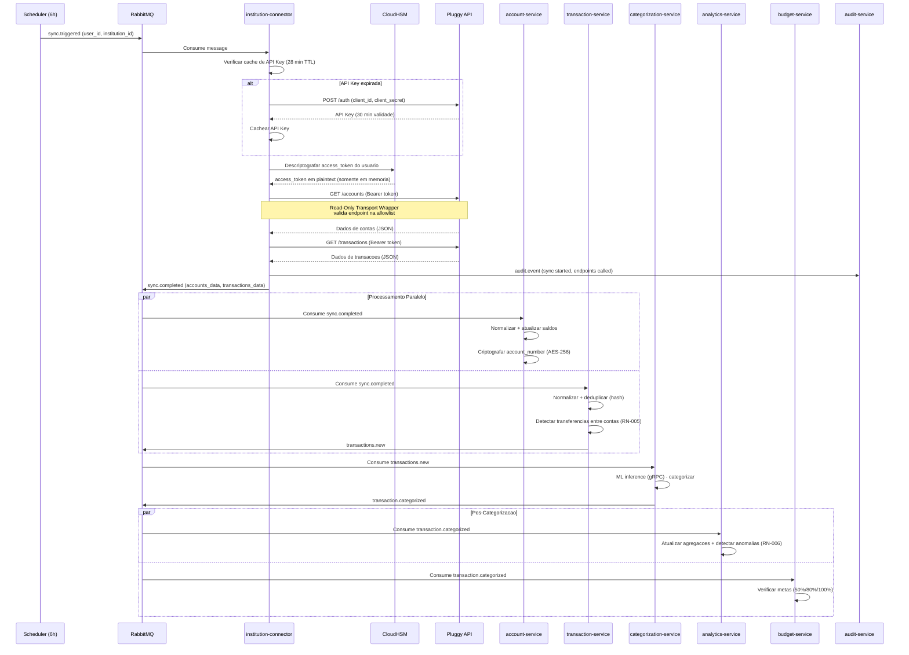
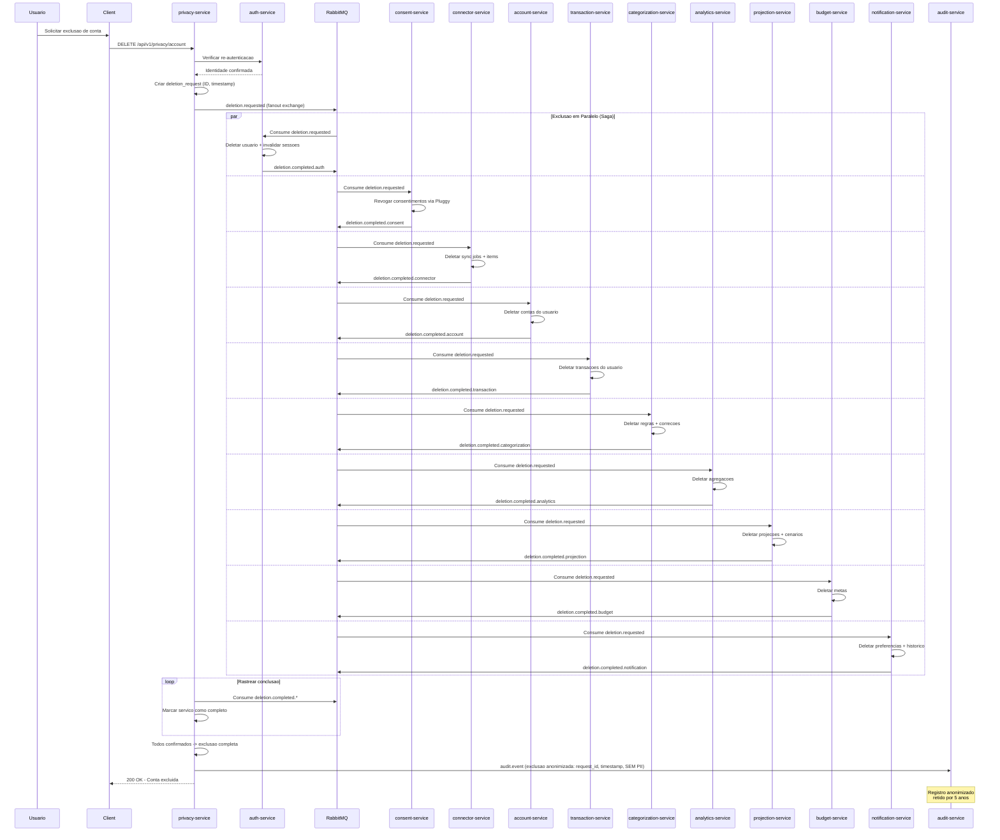
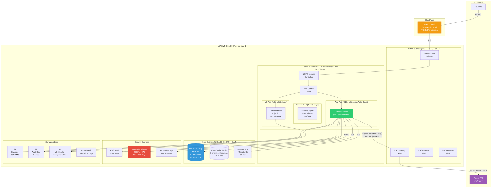
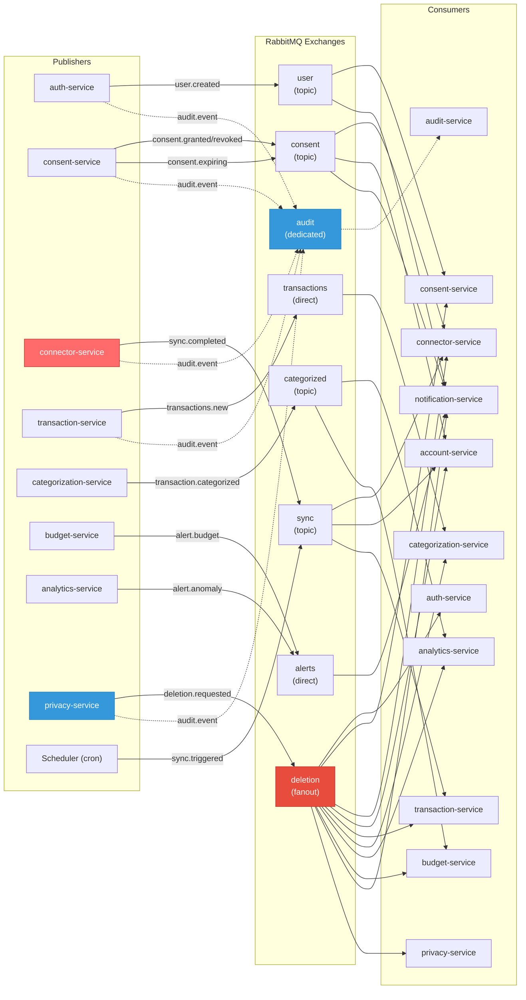

# Diagramas Arquiteturais - OpenSight

**Referencia:** Documento de Arquitetura OpenSight v1.0.0  
**Data:** 09/04/2026

> Todos os diagramas utilizam a sintaxe [Mermaid](https://mermaid.js.org/). Para visualizar, utilize editores com suporte a Mermaid (VS Code com extensao, GitHub, GitLab, ou https://mermaid.live).

---

## 1. Visao Geral da Arquitetura em Camadas

```mermaid
graph TB
    subgraph "CAMADA 1 - CLIENT"
        CLIENT["React SPA/PWA<br/>(TypeScript)"]
        MOBILE["Mobile Futuro<br/>(React Native)"]
    end

    subgraph "CAMADA 2 - EDGE / PERIMETRO"
        CF["CloudFlare<br/>WAF + DDoS Protection<br/>TLS 1.3 Termination<br/>Geo-Restrict Brasil"]
    end

    subgraph "CAMADA 3 - API GATEWAY"
        KONG["Kong Gateway<br/>JWT Validation<br/>Rate Limiting<br/>Schema Validation<br/>mTLS Backend"]
    end

    subgraph "CAMADA 4 - SERVICE MESH (EKS + Istio)"
        direction TB
        subgraph "Servicos de Autenticacao"
            AUTH["auth-service<br/>(Go)"]
            CONSENT["consent-service<br/>(Go)"]
        end
        subgraph "Servicos Core"
            CONNECTOR["institution-connector<br/>(Go) - CRITICO"]
            ACCOUNT["account-service<br/>(Go)"]
            TRANSACTION["transaction-service<br/>(Go)"]
            CATEGORIZATION["categorization-service<br/>(Python + Go)"]
        end
        subgraph "Servicos de Inteligencia"
            ANALYTICS["analytics-service<br/>(Go)"]
            PROJECTION["projection-service<br/>(Go + Python)"]
            BUDGET["budget-service<br/>(Go)"]
        end
        subgraph "Servicos de Suporte"
            NOTIFICATION["notification-service<br/>(Go)"]
            PRIVACY["privacy-service<br/>(Go) - LGPD"]
            AUDIT["audit-service<br/>(Go)"]
        end
    end

    subgraph "CAMADA 5 - DATA LAYER"
        PG[("PostgreSQL 14+<br/>12 databases<br/>AES-256 at-rest")]
        REDIS[("Redis 7+<br/>Cluster Mode<br/>TLS + KMS")]
        RABBIT["RabbitMQ<br/>(Amazon MQ)"]
    end

    subgraph "CAMADA 6 - INFRAESTRUTURA AWS sa-east-1"
        KMS["AWS KMS"]
        HSM["AWS CloudHSM<br/>RSA-4096 Keys"]
        SECRETS["AWS Secrets Manager"]
        S3["S3<br/>Backups + ML Models<br/>Audit Cold Storage"]
        ECR["ECR<br/>Container Registry"]
    end

    subgraph "EXTERNO"
        PLUGGY["Pluggy API<br/>api.pluggy.ai<br/>(Open Finance)"]
        GOOGLE["Google Identity"]
        APPLE["Apple Sign-In"]
        SES["AWS SES<br/>(Email)"]
        FCM["Firebase FCM<br/>(Push)"]
    end

    CLIENT -->|HTTPS| CF
    MOBILE -->|HTTPS| CF
    CF -->|TLS| KONG
    KONG -->|mTLS| AUTH
    KONG -->|mTLS| ACCOUNT
    KONG -->|mTLS| TRANSACTION
    KONG -->|mTLS| ANALYTICS
    KONG -->|mTLS| PRIVACY

    CONNECTOR -->|"HTTPS (READ-ONLY)<br/>Egress Gateway"| PLUGGY
    AUTH -->|OAuth 2.0 + PKCE| GOOGLE
    AUTH -->|OAuth 2.0 + PKCE| APPLE
    NOTIFICATION --> SES
    NOTIFICATION --> FCM

    AUTH --> PG
    CONSENT --> PG
    CONNECTOR --> PG
    ACCOUNT --> PG
    TRANSACTION --> PG
    CATEGORIZATION --> PG
    ANALYTICS --> PG
    PROJECTION --> PG
    BUDGET --> PG
    NOTIFICATION --> PG
    PRIVACY --> PG
    AUDIT --> PG

    AUTH --> REDIS
    KONG --> REDIS

    CONNECTOR --> RABBIT
    TRANSACTION --> RABBIT
    CATEGORIZATION --> RABBIT
    PRIVACY --> RABBIT
    AUDIT --> RABBIT

    CONNECTOR --> HSM
    CONSENT --> HSM
    AUTH --> KMS
    CATEGORIZATION --> S3

    style CONNECTOR fill:#ff6b6b,stroke:#c0392b,color:#fff
    style PRIVACY fill:#3498db,stroke:#2980b9,color:#fff
    style AUDIT fill:#2ecc71,stroke:#27ae60,color:#fff
    style HSM fill:#e74c3c,stroke:#c0392b,color:#fff
    style CF fill:#f39c12,stroke:#e67e22,color:#fff
    style PLUGGY fill:#9b59b6,stroke:#8e44ad,color:#fff
```

---

## 2. Fluxo de Autenticacao

---

## 3. Enforcement Read-Only (5 Camadas)

---

## 4. Fluxo de Sincronizacao de Dados Bancarios

---

## 5. LGPD - Cascading Delete (Direito a Exclusao)

---

## 6. Topologia de Rede (VPC)

---

## 7. Pipeline CI/CD

```mermaid
graph LR
    subgraph "Desenvolvimento"
        DEV["Developer<br/>Push"]
    end

    subgraph "GitHub Actions - Build & Test"
        LINT["Lint<br/>golangci-lint<br/>eslint"]
        TEST["Unit Tests<br/>min 80%<br/>coverage"]
        SAST["SAST Scan<br/>Semgrep<br/>gosec"]
        DEP["Dependency<br/>Scan<br/>Trivy + Snyk"]
    end

    subgraph "GitHub Actions - Container"
        BUILD["Build<br/>Container<br/>Image"]
        SCAN["Image Scan<br/>Trivy"]
        SIGN["Sign Image<br/>cosign/Sigstore"]
        PUSH["Push to<br/>ECR"]
    end

    subgraph "Staging"
        INT_TEST["Integration<br/>Tests"]
        ARGOCD_S["ArgoCD<br/>Deploy Staging"]
        SMOKE["Smoke Tests +<br/>Security Regression"]
    end

    subgraph "Producao"
        APPROVE["Aprovacao<br/>Manual"]
        ARGOCD_P["ArgoCD<br/>Canary Deploy"]
        VERIFY["Post-Deploy<br/>Verification"]
    end

    DEV --> LINT
    LINT --> TEST
    TEST --> SAST
    SAST --> DEP
    DEP --> BUILD
    BUILD --> SCAN
    SCAN --> SIGN
    SIGN --> PUSH
    PUSH --> INT_TEST
    INT_TEST --> ARGOCD_S
    ARGOCD_S --> SMOKE
    SMOKE --> APPROVE
    APPROVE --> ARGOCD_P
    ARGOCD_P --> VERIFY

    LINT -.->|FAIL| BLOCK_L["BLOCKED"]
    TEST -.->|"< 80%"| BLOCK_T["BLOCKED"]
    SAST -.->|HIGH/CRIT| BLOCK_S["BLOCKED"]
    DEP -.->|CRIT CVE| BLOCK_D["BLOCKED"]
    SCAN -.->|CRIT vuln| BLOCK_I["BLOCKED"]

    style BLOCK_L fill:#e74c3c,color:#fff
    style BLOCK_T fill:#e74c3c,color:#fff
    style BLOCK_S fill:#e74c3c,color:#fff
    style BLOCK_D fill:#e74c3c,color:#fff
    style BLOCK_I fill:#e74c3c,color:#fff
    style APPROVE fill:#f39c12,stroke:#e67e22,color:#fff
    style VERIFY fill:#2ecc71,stroke:#27ae60,color:#fff
```

---

## 8. Fluxo de Eventos (Mensageria Assincrona)

---

## 9. Camadas de Criptografia

```mermaid
graph TB
    subgraph "Em Transito"
        TLS["TLS 1.3<br/>(min 1.2)"]
        MTLS["mTLS (Istio)<br/>X.509 ECDSA P-256<br/>Rotacao 24h auto"]
    end

    subgraph "Em Repouso"
        TDE["PostgreSQL TDE<br/>AES-256<br/>AWS KMS CMK"]
        S3E["S3 SSE-KMS<br/>AES-256"]
        REDE["Redis<br/>At-Rest KMS"]
    end

    subgraph "Criptografia de Coluna"
        BCRYPT["Senhas<br/>bcrypt cost 12<br/>(one-way hash)"]
        TOTP_E["2FA Secrets<br/>AES-256-GCM<br/>KMS DEK"]
        ACCT_E["Account Numbers<br/>AES-256"]
        DESC_E["Descriptions (PII)<br/>AES-256"]
    end

    subgraph "Tokens Bancarios (Maximo Nivel)"
        RSA["RSA-4096<br/>Criptografia Assimetrica"]
        HSM_K["Chave Privada<br/>NUNCA sai do HSM"]
        PUB_K["Chave Publica<br/>Criptografa antes<br/>do armazenamento"]
        
        RSA --> HSM_K
        RSA --> PUB_K
    end

    subgraph "Gerenciamento de Chaves"
        KMS_S["AWS KMS<br/>Rotacao Anual"]
        HSM_S["AWS CloudHSM<br/>Rotacao Trimestral"]
        CITADEL["Istio Citadel<br/>Rotacao 24h"]
        ACM["AWS ACM<br/>Auto-Renewal"]
    end

    TLS --> ACM
    MTLS --> CITADEL
    TDE --> KMS_S
    S3E --> KMS_S
    REDE --> KMS_S
    TOTP_E --> KMS_S
    ACCT_E --> KMS_S
    DESC_E --> KMS_S
    RSA --> HSM_S

    style HSM_K fill:#e74c3c,stroke:#c0392b,color:#fff
    style RSA fill:#e74c3c,stroke:#c0392b,color:#fff
    style HSM_S fill:#e74c3c,stroke:#c0392b,color:#fff
```

---

## Legenda de Cores

| Cor | Significado |
|-----|-------------|
| Vermelho | Seguranca critica / HSM / Read-Only enforcement |
| Azul | LGPD / Privacy / Compliance |
| Verde | Operacional / Sucesso / Verificacao |
| Amarelo/Laranja | Edge protection / Aprovacao manual |
| Roxo | Integracao externa (Pluggy) |
